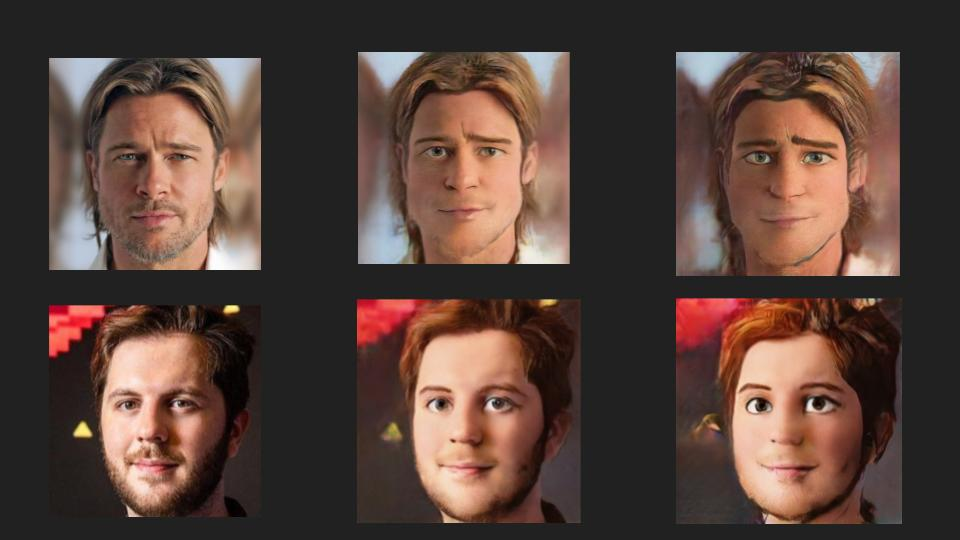

# Мультификация лиц
Здесь вы найдете телеграмм бота для преобразования лиц в мультяшные, а также .ipynb файлы для обучения моделей

## Ход работы
### Создание датасета
Для того, чтобы обучить модель для начала было необходимо создать датасет.
Для его генерации были использованы 2 модели:

1) Обычный StyleGan3, который генерит лица
2) Дообученный на мультяшных лицах StyleGan3

После дообучения на диснеевских наши модели, необходимо сгенерировать парный датасет.
Для этого будем подавать одинаковый шум на вход нашим двум моделям. В таком случае мы для одного и того же шума 
получим изображение реального человека, созданного из него и перерисовку.

**Блендинг моделей**

Чтобы добится лучшего качества созданий перерисовок, модели блендятся - берется взвешенная сумма по слоям.
`new_weight = weight_cartoon * blend[i] + weight_real * (1 - blend[i])`

На начальных слоях берутся в основном веса обычного StyleGan3, чтобы сохранялись основывные черты лица, а под конец 
используются веса дообученного.

`blend = [0.5, 0.5, 0.5, 0.6, 0.6, 0.7, 0.7, 0.9, 0.9, 1, 1, 1, 1, 1, 1]`
