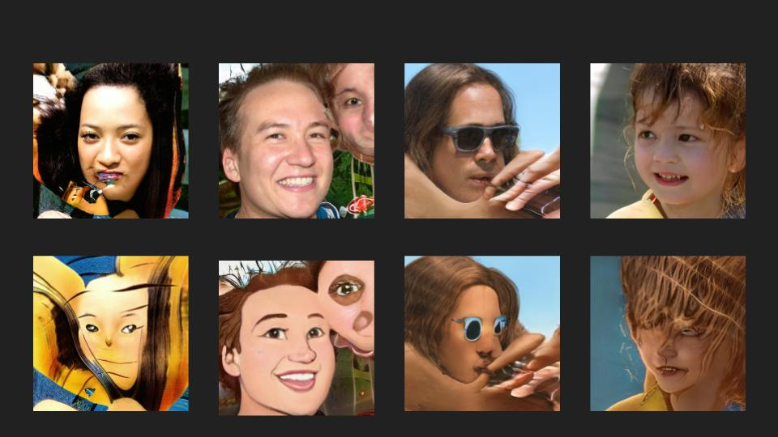

# Мультификация лиц
Здесь вы найдете телеграмм бота для преобразования лиц в мультяшные, а также .ipynb файлы для обучения моделей

## Ход работы
Сам процесс можно разделить на три большие части:
1) Создание парного датасета
2) Его очистка
3) Обучение pix2pix модели

### Создание датасета
[Блокнот для генерации датасета](./notebooks/Generate_dataset.ipynb)

Для того, чтобы обучить модель для начала было необходимо создать датасет.
Для его генерации были использованы 2 модели:

1) Обычный StyleGan3, который генерит лица
2) Дообученный на мультяшных лицах StyleGan3

После дообучения нашей модели на диснеевских необходимо сгенерировать парный датасет.
Для этого будем подавать одинаковый шум на вход нашим моделям. В таком случае мы для одного и того же шума 
получим изображение реального человека и созданную из него и перерисовку. В итоге было создано 20000 пар изображений,
на который в дальнейшем обучался генератор.

**Блендинг моделей**

Чтобы добится лучшего качества созданий перерисовок, модели блендятся - берется взвешенная сумма по слоям.
`new_weight = weight_cartoon * blend[i] + weight_real * (1 - blend[i])`

На начальных слоях берутся в основном веса обычного StyleGan3, чтобы сохранялись основывные черты лица, а под конец 
используются веса дообученного.

`blend = [0.5, 0.5, 0.5, 0.6, 0.6, 0.7, 0.7, 0.9, 0.9, 1, 1, 1, 1, 1, 1]`

### Очистка данных
[Блокнот для очистки датасета](./notebooks/Clear_face_cartonizing_dataset.ipynb)

Из радномного шума не всегда получаются хорошие лица, и даже из хороших лиц не всегда получаются удачные мультифиикации.
Поэтому нужно очистить датасет. 

Для этого создается еще один небольшой датасет, в котором всего есть два класса good - изображение хорошее, и bad - его лучше 
не использовать в дальнейшем. Так как если было плохое начальное изображение, то и мультификация тоже будет не очень, поэтому я сделал этот новый датасет только из 
сгенерированных перерисовок. Всего у меня было примерно по 300 изображений на каждый класс. После это обучается простенький классфикатор, который
учится определять хорошая эта картинка или нет.

#### Снимаем ~~розовые~~ очки
Как я неожиданно выяснил после пристального взгляда на сгенеренный датасет, дообученный StyleGan3 плохо работает с очками, особенно солнцезащитными
~~ненавижу солцезащитные очки~~. Он пытается нарисовать поверх них глаза и получатся белые пятна на черных линзах. А при перерисовке обычных очков, он частенько
либо просто их не рисовал, либо не дорисовывал переносится, так что пришлось сделать два этапа очистки: 
1) вначале убрать все фотки, где есть очки (так как бывало, что они есть только на 
нормальных лицах, а на перерисовках нет)
2) А потом то, что плохо перерисовалось

### Обучение pix2pix
[Блокнот для обучения pix2pix](./notebooks/Face_cartoonizing.ipynb)

Последним этапом было обучить модель, которая на вход принимает изображение лица и выдает перерисовку.

За основу модели был взят Unet-образный генератор. Итоговый датасет, на котором обучалась эта модель, содержал ~10000 пар (лицо, перерисовка)

## Телеграмм бот
[@face_cartoonizing](https://t.me/face_cartoonizing_bot)

Сам бот написан на aiogram и является ассинхронным. 

Процесс мультификации:
1) Найти на изображение лица людей и вырезать их
2) Центрировать лицо, чтобы глаза располагались по центру. Так как StyleGan3 генерирует центрированные изображения, 
то и наш парный датасет тоже будет содержать такие лица, поэтому лучше привести изображение в такой же формат
Для этого использовал [утилитку](./face_aligner.py) из документации StyleGan3
3) Теперь просто прогоняем каждое из лиц через pix2pix generator и получаем перерисованные картинки

